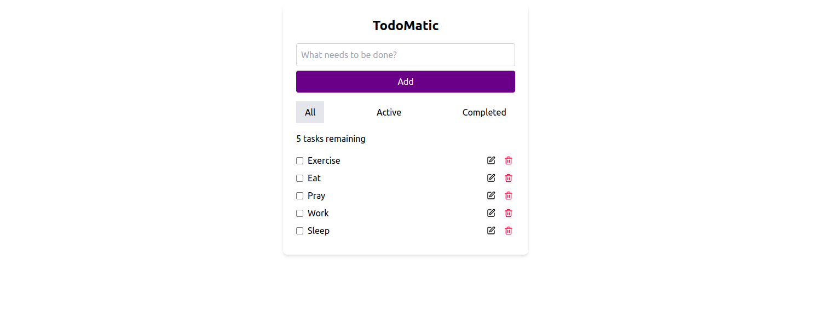

# TodoMatic

TodoMatic is a simple, interactive, and user-friendly to-do list application built with React. It allows users to manage tasks by adding, toggling completion, deleting, and filtering them based on their status. 

## Features

- Add new tasks to the list.
- Mark tasks as completed or uncompleted.
- Delete tasks.
- Filter tasks by their status: All, Active (uncompleted), and Completed.
- Task counter that shows how many tasks remain incomplete.

## Screenshots



## Technologies Used

- **React**: A JavaScript library for building user interfaces.
- **Lucide-react**: Icon library used for edit and delete icons.
- **Tailwind CSS**: A utility-first CSS framework used for styling.

## Getting Started

### Prerequisites

Make sure you have the following installed on your machine:
- [Node.js](https://nodejs.org/en/)
- [npm](https://www.npmjs.com/get-npm) (comes with Node.js)

### Installation

1. Clone this repository to your local machine:
    ```bash
    git clone https://github.com/your-username/todo-app.git
    ```
   
2. Navigate to the project directory:
    ```bash
    cd todo-app
    ```

3. Install dependencies:
    ```bash
    npm install
    ```

4. Start the development server:
    ```bash
    npm start
    ```

5. Open `http://localhost:3000` in your browser to view the app.

## How to Use

1. **Add a task**: Type a task in the input field and click the "Add" button. The new task will be added to the list.
2. **Complete a task**: Mark a task as complete by clicking the checkbox next to it.
3. **Delete a task**: Click the trash icon next to a task to delete it.
4. **Filter tasks**: Use the filter buttons (`All`, `Active`, `Completed`) to display tasks based on their completion status.


